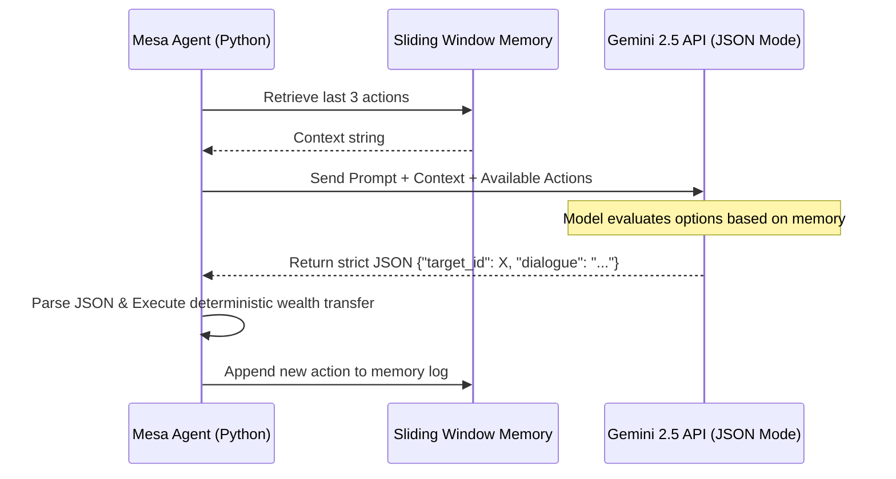

# Mesa-LLM: Generative Agent Prototype & Learning Space

This repository serves as my technical sandbox and proof-of-work for the Google Summer of Code 2026 project: **Mesa-LLM (Production-Ready Generative Agents)**.

My objective is to bridge the gap between Large Language Models (generative text) and Mesa's Agent-Based Modeling framework (deterministic Python) without succumbing to token-limit exhaustion or brittle regex parsing failures.

## 🚀 Core Prototype: `2_LLM_Agent.ipynb`

Instead of standard ABM tutorials, I immediately pivoted to building a functional neuro-symbolic bridge. This notebook contains a custom `LLMAgent` and `LLMModel` that successfully integrates the Gemini 2.5 API directly into the Mesa step-function.

### 🧠 System Architecture & Workflow



Key Architectural Solutions Implemented:

Context Window Management (Sliding-Window Memory): LLMs are stateless, but passing an agent's entire simulation history into every prompt rapidly burns API tokens and increases latency. I implemented a sliding-window memory array (self.memory[-3:]) that only feeds the most recent, relevant state changes to the LLM context.

Deterministic Action Parsing (Structured JSON): Mesa cannot compile natural language into variable changes. Instead of relying on regex to extract intent, I utilize Gemini's GenerationConfig to force the LLM to output strict, executable JSON (response_mime_type="application/json"). The framework parses this JSON to securely execute Python state changes (e.g., integer wealth transfers).

⚙️ How to Run the Prototype

To replicate this environment locally and see the generative agents interact:

Clone this repository and activate your Python virtual environment.

Install the required dependencies:

```bash
pip install mesa-llm google-generativeai python-dotenv
```

Create a .env file in the root directory and add your Google API key:

```env
GOOGLE_API_KEY=your_api_key_here
```

Run all cells in 2_LLM_Agent.ipynb.

👨‍💻 About the Author

Laxmiranjan Sahu | AI/ML Intern | Generative AI Professional (Oracle Certified)

Focusing heavily on Python development, async API optimization, and agentic workflows.

Push this file to your main branch (`git add README.md`, `git commit -m "Added architectural README with Mermaid system diagram"`, `git push origin main`). 

Once it is pushed, refresh your GitHub repository page in your browser. You will see that code block magically render into a professional system design diagram right in the middle of your page.

Tell me when that is live, and we execute the final Matrix chat maneuver.

## 🔗 Connect with Me

<p align="left">
  <a href="https://www.linkedin.com/in/laxmiranjan">linkedin.com/in/laxmiranjan</a> |
  <a href="https://github.com/laxmi2577">github.com/laxmi2577</a> |
  <a href="mailto:laxmiranjan444@gmail.com">laxmiranjan444@gmail.com</a>
</p>
