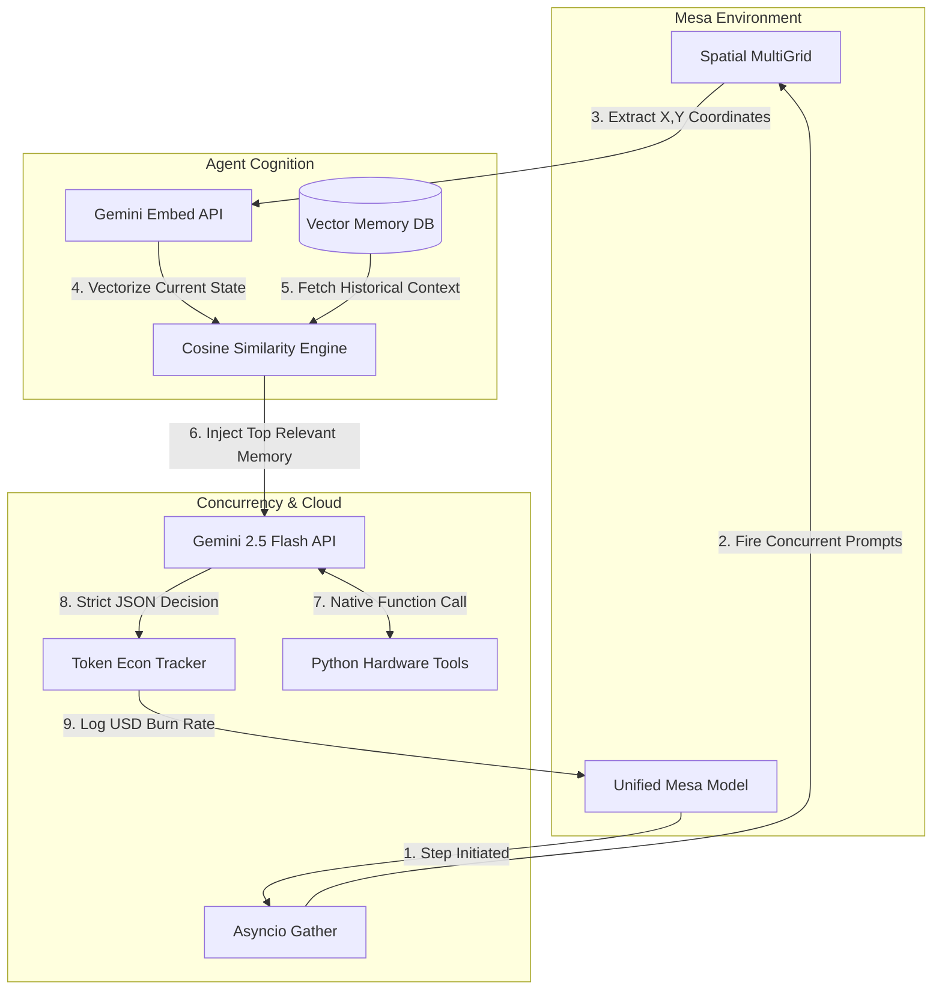

# Mesa LLM Production Ready Generative Agents

📄 **[Read my GSoC Motivation & Professional Background here](motivation.md)**

This repository serves as my technical sandbox and proof-of-work for the Google Summer of Code 2026 project: **Mesa-LLM (Production-Ready Generative Agents)**.

## Abstract
My objective is to bridge the gap between Large Language Models (generative text) and Mesa's Agent-Based Modeling framework (deterministic Python) without succumbing to token-limit exhaustion, sequential bottlenecks, or brittle regex parsing failures.

## Background & Architecture

This project was built iteratively, escalating from basic API calls to a fully unified, neuro-symbolic multi-agent system. 

* **Phase 1 & 2: LLM Integration & Strict JSON Routing:** Replaced random number generators with Gemini 2.5 Flash. Forced the LLM to output valid JSON arrays, which are directly parsed into deterministic Mesa state changes.
* **Phase 3: Multi-Agent Conversational Memory:** Implemented sliding-window memory arrays so agents can read conversational histories and base their actions on prior steps without blowing up the context window.
* **Phase 4: Spatial Grid Awareness:** Agents are injected with Mesa `MultiGrid` coordinates and successfully navigate `(x, y)` environments based on persona-driven goals.
* **Phase 5: Latency Profiler:** Built an automated benchmarking tool confirming an average synchronous API round-trip latency of ~2.2 seconds per agent step.
* **Phase 6: Token Economics Engine:** Engineered a live budget tracker that extracts hidden `usage_metadata` from the Google SDK. Benchmarks proved a standard 6-step multi-agent interaction loop costs exactly **$0.000028 USD**, demonstrating financial viability for scale.
* **Phase 7: Native Tool Calling:** Upgraded agents from chatbots to autonomous systems using the Gemini `tools` parameter. Agents now pause text generation to natively execute local Python functions (e.g., hardware scanners) and use the returned data.
* **Phase 8: Asynchronous Concurrency:** Rewrote the API routing using `asyncio` and `nest_asyncio`. Agents now generate thoughts in parallel, collapsing a 6.6-second sequential step down to **~2.05 seconds** total for the entire batch.
* **Phase 9: Native RAG Memory:** Replaced append-only memory with a Retrieval-Augmented Generation system. Agents embed current situations into vectors (`gemini-embedding-001`) and use Cosine Similarity math to extract only the most relevant historical memories.
* **Phase 10: The Grand Unification:** A singular, end-to-end Mesa simulation where spatial awareness, asynchronous execution, tool calling, RAG memory, and token economics run concurrently without crashing the scheduler.




## Model Description (Mechanics)

### 1. Context Window Management (Sliding-Window Memory)

LLMs are stateless, but passing an agent's entire simulation history into every prompt rapidly increases API token usage and latency.

To address this, a sliding-window memory approach is implemented:

```python
self.memory[-3:]
```

This ensures that only the most recent and relevant state changes are included in the LLM context, improving efficiency while preserving important information.

---

### 2. Deterministic Action Parsing (Structured JSON)

Mesa cannot directly convert natural language into executable state changes.

Instead of relying on fragile regex parsing, the system uses Gemini's `GenerationConfig` to enforce structured output:

```python
response_mime_type="application/json"
```

This guarantees that the LLM returns strict, machine-readable JSON. The framework then safely parses this JSON to execute Python-based state changes (e.g., integer wealth transfers), ensuring reliability and security.

## How to Run 

To replicate this environment locally and see the generative agents interact across the grid:

### 1. Clone this repository and activate your Python virtual environment.

### 2. Install the required dependencies:

```bash
pip install mesa-llm google-generativeai python-dotenv nest-asyncio
```

### 3. Create a `.env` file in the root directory and securely add your Google API key:

```env
GOOGLE_API_KEY=your_api_key_here
```

### 4. Run the Jupyter Notebooks sequentially, or jump straight to `10_End_to_End_Engine.ipynb` to see the fully unified architecture.


## Results & Token Economics

- **Average Cost per Simulation Loop:** $0.000028 USD  
- **Async Execution Latency:** ~2.05 seconds (parallel execution)  
- **Sequential Latency (baseline):** ~6.6 seconds  

These results demonstrate that the system achieves both **cost-efficiency** and **low-latency performance**, validating its feasibility for scalable real-world multi-agent simulations.


## About the Author

Laxmiranjan Sahu | AI/ML Intern | Generative AI Professional (Oracle Certified)

Focusing heavily on Python development, async API optimization, and agentic workflows.

## 🔗 Connect with Me

<p align="left">
  <a href="https://www.linkedin.com/in/laxmiranjan">linkedin.com/in/laxmiranjan</a> |
  <a href="https://github.com/laxmi2577">github.com/laxmi2577</a> |
  <a href="mailto:laxmiranjan444@gmail.com">laxmiranjan444@gmail.com</a>
</p>
